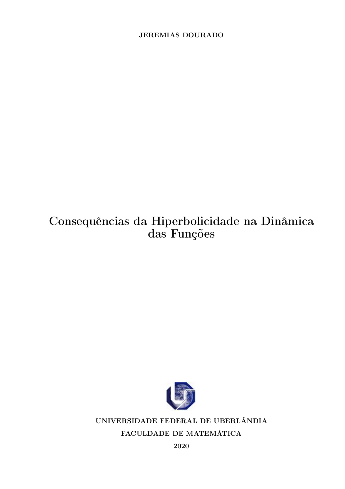

Dissertação defendida no Programa de Pós-Graduação em Matemática da Universidade Federal de Uberlândia, como parte dos requisitos para obtenção do título de MESTRE EM MATEMÁTICA. A mesma está publicada no [Repositório Institucional - Universidade Federal de Uberlândia](https://repositorio.ufu.br/handle/123456789/28953).

# Consequências da Hiperbolicidade na Dinâmica das Funções
<h3>
- Aluno: <b> Jeremias Dourado </b>
- Número da Matrícula: <b> 11812MAT004 </b>
- Área de Concentração: <b> Matemática </b>
- Linha de Pesquisa: <b> Sistemas Dinâmicos </b> 
- Orientador: <b> Prof. Dr. Thiago Aparecido Catalan</b> 
</h3> 
<h4>
Esta dissertação foi APROVADA em reunião pública realizada na Sala Multiuso da Faculdade
de Matemática, Bloco 1F, Campus Santa Mônica, em 17 de fevereiro de 2020, às 14h, pela
seguinte Banca Examinadora: 

- Prof. Dr. Thiago Aparecido Catalan da UFU - Universidade Federal de Uberlândia 
- Prof. Dr. Vanderlei Minori Horita da UNESPE - Universidade Estadual Paulista "Júlio de Mesquita Filho"
- Prof. Dr. Jean Venato Santos da UFU - Universidade Federal de Uberlândia
</h4>
